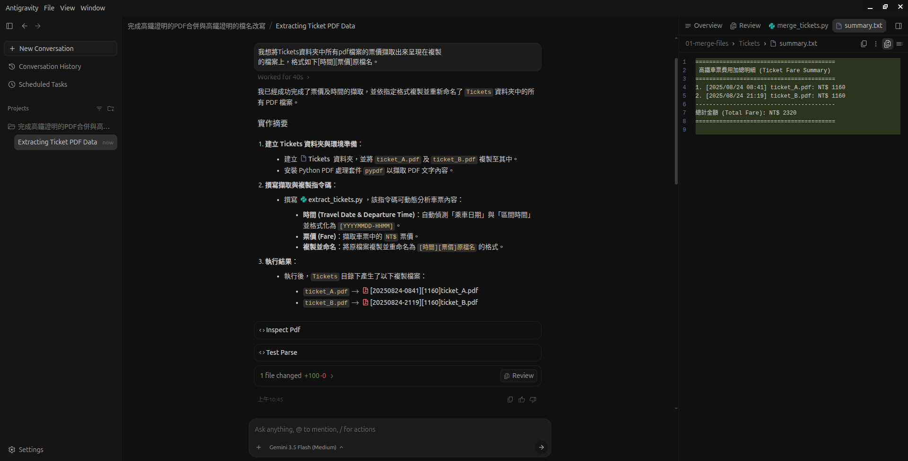

### 01-merge-files 任務與前置作業
#### 要完成的任務
 - 完成高鐵證明的PDF合併
 - 完成高鐵證明的檔名改寫
#### 前置作業
 - 新增資料夾存放兩份PDF檔
 - 檔名路徑(可自行取名)
 - 範例 : ```antigravity-2.0/01-merge-files```

#### 提出問題
 - 我想將Tickets資料夾中所有pdf檔案的票價擷取出來呈現在複製
的檔案上，格式如下[時間][票價]原檔名。
 - 我想要把這些[時間][票價]原檔名的pdf合併成一份。
 - 費用加總

#### 輸出結果
