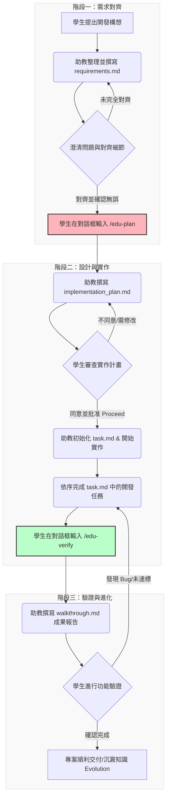

# Project Guider - 學生開發協作與引導環境

歡迎來到 **Project Guider**！這是一個專門為學生設計的程式開發與學習環境。在這裡，你將與一位**溫和、有耐心的資深軟體開發助教 (AI)** 共同合作，從釐清需求、設計架構、撰寫程式到最後的測試驗證，助教都會一步步引導你前行，幫助你建立良好的軟體工程思維。

---

## 🚀 專案定位與助教角色

本專案的核心目標是幫助你**「學習如何寫出結構好、易維護的程式」**。
在開發過程中，**所有程式碼實作均由 AI 助教負責撰寫**，但這並不代表你可以當「甩手掌櫃」喔！助教的引導機制會確保你深入參與：
- 💡 **思考細節**：引導你思考需求的邊界條件與潛在問題。
- 🔍 **審查計畫**：在動工前由你審查實作計畫，確保開發方向正確。
- 🧪 **親自驗證**：實作完畢後，由你進行功能測試，確保符合預期。

---

## 📋 協作流程指南：三階段與四大文件

為了讓開發過程透明且有條理，我們採用「三階段開發流程」，並透過「四大文件」來記錄與追蹤進度。

### 1. 協作流程圖 (Mermaid)

當你向助教發起新需求或開始寫作業時，流程將如下運作：



### 2. 開發三階段與斜線指令 (Commands)

*   **【階段一】需求對齊 (`/edu-start` 或直接描述需求)**
    *   **做什麼**：你告訴助教想做什麼，助教幫你整理成需求文件。
    *   **下一步**：確認需求無誤後，輸入 `/edu-plan`。
*   **【階段二】設計與實作 (`/edu-plan`)**
    *   **做什麼**：助教提出實作計畫與步驟。你點擊計畫的 **Proceed** 同意後，助教便會建立 `task.md` 並開始寫扣。
    *   **下一步**：當助教寫完所有功能後，輸入 `/edu-verify`。
*   **【階段三】驗證與進化 (`/edu-verify`)**
    *   **做什麼**：助教提供成果報告。你進行測試並確認程式碼運作正常。

### 3. 四大協作文件 (Documents)

在專案開發過程中，助教與你將共同維護以下四個 Markdown 檔案：

| 檔案名稱 | 說明 | 負責撰寫/更新 |
| :--- | :--- | :--- |
| **`requirements.md`** | **需求文件**：記錄專案目標、功能、技術與非功能性需求、使用者情境（若技術問題無法回答，將採取助教的建議）。 | AI 助教整理，學生審查 |
| **`implementation_plan.md`** | **實作計畫**：描述檔案結構、技術選型、實作步驟與驗證方法。 | AI 助教撰寫，學生批准 |
| **`task.md`** | **進度追蹤表**：將計畫拆解為可勾選的 TODO 項目，追蹤實作狀態。 | AI 助教隨開發進度即時更新 |
| **`walkthrough.md`** | **成果報告**：總結實作的修改、測試結果與可以學習的知識點。 | AI 助教在完成後提供 |

---

## 🛠️ 開發環境設定 (Python `uv`)

為確保你的 Python 開發環境乾淨、不與系統的全域套件衝突，本專案**強制規定使用 `uv` 工具建立與管理虛擬環境**。

> [!TIP]
> **什麼是 `uv`？**
> `uv` 是由 Astral 開發的超快速 Python 套件與環境管理器，速度比傳統的 `pip` 與 `venv` 快上 10~100 倍！

### 1. 安裝 `uv`

請打開你的終端機（Windows 請用 PowerShell，macOS/Linux 用 Terminal），執行以下對應的指令：

*   **Windows (PowerShell)**:
    ```powershell
    powershell -c "irm https://astral.sh/uv/install.ps1 | iex"
    ```
*   **macOS / Linux (Shell)**:
    ```bash
    curl -LsSf https://astral.sh/uv/install.sh | sh
    ```

> [!NOTE]
> 安裝完成後，如果出現「找不到 uv 指令」的錯誤，請重啟你的終端機或編輯器（如 VS Code）以套用環境變數。

### 2. 建立與管理虛擬環境

進入專案目錄後，使用以下指令：

-   **建立虛擬環境**：
    ```bash
    uv venv
    ```
    *這會在專案根目錄下建立一個名為 `.venv` 的資料夾。*

-   **啟用虛擬環境**：
    *   **Windows (PowerShell)**:
        ```powershell
        .venv\Scripts\Activate.ps1
        ```
    *   **macOS / Linux**:
        ```bash
        source .venv/bin/activate
        ```
    *(啟用成功後，你的終端機提示字元前方會出現 `(.venv)` 的標記)*

-   **安裝開發套件**（需在啟用虛擬環境後執行）：
    ```bash
    uv pip install <套件名稱>
    ```
    例如安裝 `requests` 庫：`uv pip install requests`

---

## 🏁 快速上手：開始你的第一個功能

現在你已經了解整個專案的協作模式了，準備好開始了嗎？

1. **想好你的開發構想**（例如：「我想寫一個簡易的記帳 Python 程式」）。
2. **告訴你的 AI 助教**（直接在對話框中描述你的需求）。
3. 助教將會為你建立 `requirements.md`，並帶領你開始！

> [!IMPORTANT]
> 記住，在開發中遇到任何看不懂的程式碼或設計架構，都可以隨時問助教：「**這個地方為什麼要這樣設計？**」或「**這行程式碼是什麼意思？**」，助教會非常樂意為你詳細解說喔！
